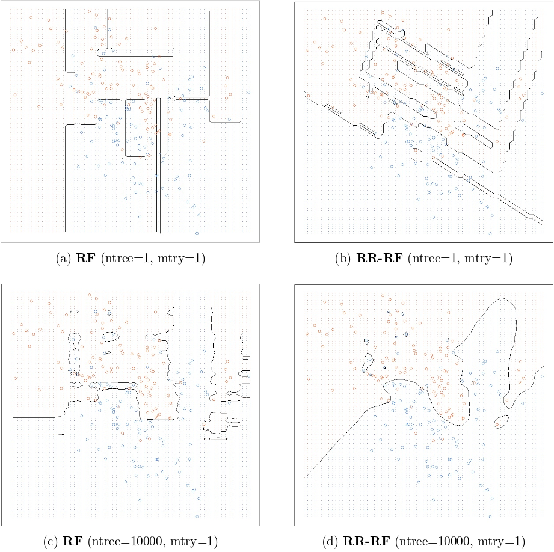

sklearn-compatible Random Rotation Ensembles
===============

Scikit-learn compatible implementations of the recent Random Rotation Ensemble idea of [Blaser & Fryzlewicz, 2016](http://jmlr.org/papers/volume17/blaser16a/blaser16a.pdf). 

The authors show that random rotations of the feature space in the individual classifiers within the ensemble can improve ensemble diversity, and thus overall ensemble accuracy; especially for tree-based ensembles. See example from Figure 1 in the paper (top row: single decision tree, bottom row: forest; left column: traditional random forest; right column: random rotation in each decision tree)



Two such tree-based models are implemented here, Random Forests and Extremely Randomized Tree classifiers, and compared below to scikit's standard implementations.

The UCI comparison suite may itself be useful for prototyping and testing new machine learning models. It can take any descendant of sklearn BaseEstimator, any list of mldata.org dataset names, and any dict of scoring functions. See usage below.

Usage
===============

Usage example of the Random Rotation (RR) Ensembles:

```python
from uci_loader import *
X, y = getdataset('diabetes')

from rr_forest import RRForestClassifier
from rr_extra_forest import RRExtraTreesClassifier
from sklearn.ensemble.forest import RandomForestClassifier

classifier = RRForestClassifier(n_estimators=20)
classifier.fit(X[:len(y)/2], y[:len(y)/2])
print "Random Rotation Forest Accuracy:", np.mean(classifier.predict(X[len(y)/2:]) == y[len(y)/2:])

classifier = RRExtraTreesClassifier(n_estimators=20)
classifier.fit(X[:len(y)/2], y[:len(y)/2])
print "Random Rotation Extra Trees Accuracy:", np.mean(classifier.predict(X[len(y)/2:]) == y[len(y)/2:])

classifier = RandomForestClassifier(n_estimators=20)
classifier.fit(X[:len(y)/2], y[:len(y)/2])
print "Random Forest Accuracy:", np.mean(classifier.predict(X[len(y)/2:]) == y[len(y)/2:])
```

Usage example for the UCI comparison:

```python
from uci_comparison import compare_estimators
from sklearn.ensemble.forest import RandomForestClassifier, ExtraTreesClassifier
from rr_forest import RRForestClassifier
from rr_extra_forest import RRExtraTreesClassifier

estimators = {
              'RandomForest': RandomForestClassifier(n_estimators=160, n_jobs=-1),
              'RndRotForest': RRForestClassifier(n_estimators=160, n_jobs=-1),
              'ExtraTrees': ExtraTreesClassifier(n_estimators=160, n_jobs=-1),
              'RndRotETrees': RRExtraTreesClassifier(n_estimators=160, n_jobs=-1),
            }

# optionally, pass a list of UCI dataset identifiers as the datasets parameter, e.g. datasets=['iris', 'diabetes']
# optionally, pass a dict of scoring functions as the metric parameter, e.g. metrics={'F1-score': f1_score}
compare_estimators(estimators)
"""
                          ExtraTrees F1score  RandomForest F1score  RndRotETrees F1score  RndRotForest F1score
==============================================================================================================
  breastcancer (n=683)     *0.961 (SE=0.003)      0.957 (SE=0.004)      0.960 (SE=0.003)      0.957 (SE=0.003)
       breastw (n=699)      0.947 (SE=0.004)      0.954 (SE=0.005)      0.952 (SE=0.005)     *0.967 (SE=0.002)
      creditg (n=1000)      0.369 (SE=0.005)      0.360 (SE=0.004)      0.372 (SE=0.005)     *0.384 (SE=0.004)
      haberman (n=306)      0.292 (SE=0.017)     *0.308 (SE=0.014)      0.225 (SE=0.018)      0.284 (SE=0.019)
         heart (n=270)     *0.842 (SE=0.007)      0.827 (SE=0.005)      0.796 (SE=0.008)      0.832 (SE=0.004)
    ionosphere (n=351)      0.724 (SE=0.037)      0.718 (SE=0.037)     *0.744 (SE=0.037)      0.741 (SE=0.037)
          labor (n=57)      0.238 (SE=0.016)      0.240 (SE=0.020)     *0.271 (SE=0.013)      0.257 (SE=0.018)
liverdisorders (n=345)      0.650 (SE=0.018)      0.651 (SE=0.017)      0.639 (SE=0.012)     *0.663 (SE=0.017)
     tictactoe (n=958)      0.030 (SE=0.007)     *0.031 (SE=0.007)      0.030 (SE=0.007)     *0.031 (SE=0.007)
          vote (n=435)     *0.658 (SE=0.012)     *0.658 (SE=0.012)     *0.658 (SE=0.012)     *0.658 (SE=0.012)
"""
```
